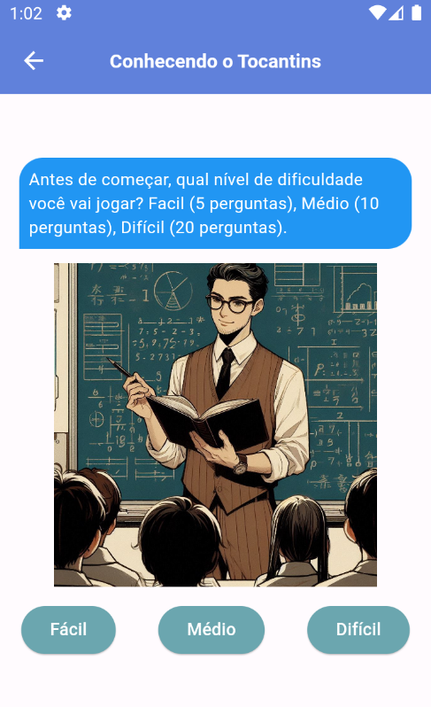
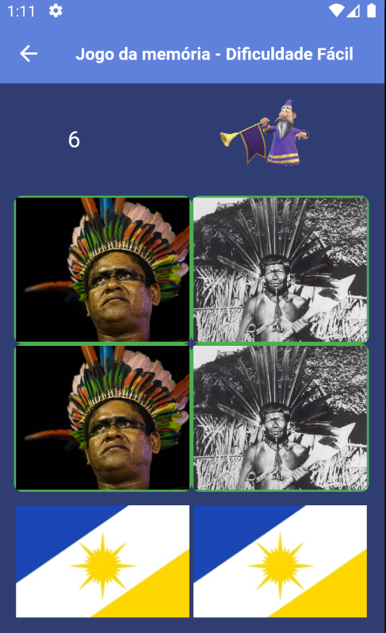
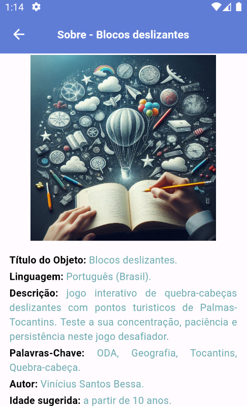
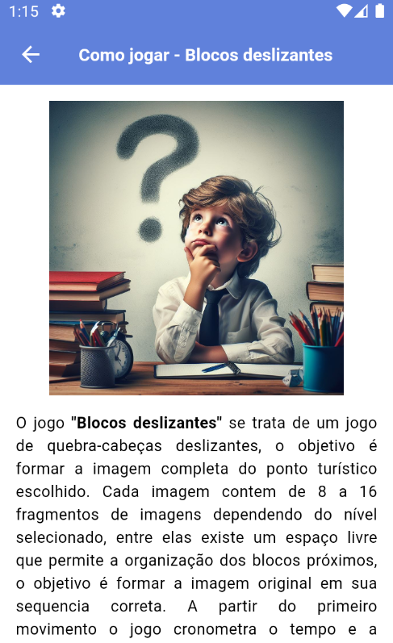
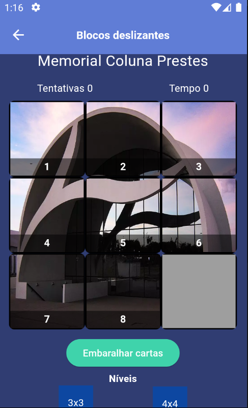
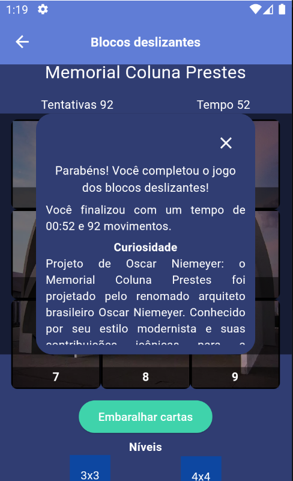

# Geograpp

Aplicativo para o ensino-aprendizagem de geografia do 6º e 7º ano do ensino fundamental sobre o tocantins. 

## Dependencias utilizadas

- animated_text_kit: utilizado para criar o efeito de escrita nos textos.

- group_button: utilizado para controlar as alternativas das perguntas

- flutter_native_splash: utilizado para modificar a tela de carregamento inicial ao iniciar o aplicativo pela 1ª vez

- flutter_launcher_icons: utilizado para modificar o ícone do aplicativo

- audioplayers: inserir e manipular sons no aplicativo

- confetti: efeito de confetes sendo disparados

- url_laucher: utilizado para abrir endereços url

## Imagens

Jogo 1: quiz conhecendo o Tocantins

Jogo 2: jogo da memória

Jogo 3: blocos deslizantes

