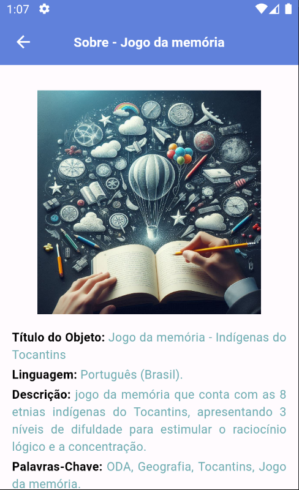
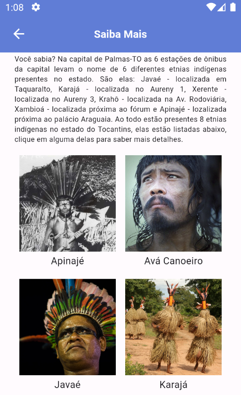
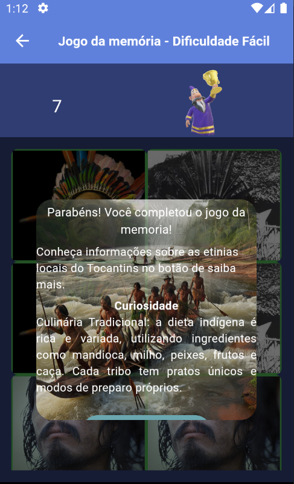

# geograpp

Aplicativo para o ensino-aprendizagem de geografia do 6º e 7º ano do ensino fundamental sobre o tocantins. 

## Dependencias utilizadas

- animated_text_kit: utilizado para criar o efeito de escrita nos textos.

- group_button: utilizado para controlar as alternativas das perguntas

- flutter_svg: utilizado para inserir icones personalizados

## Imagens

- Jogo 1: quiz conhecendo o Tocantins

- Jogo 2: jogo da memória

